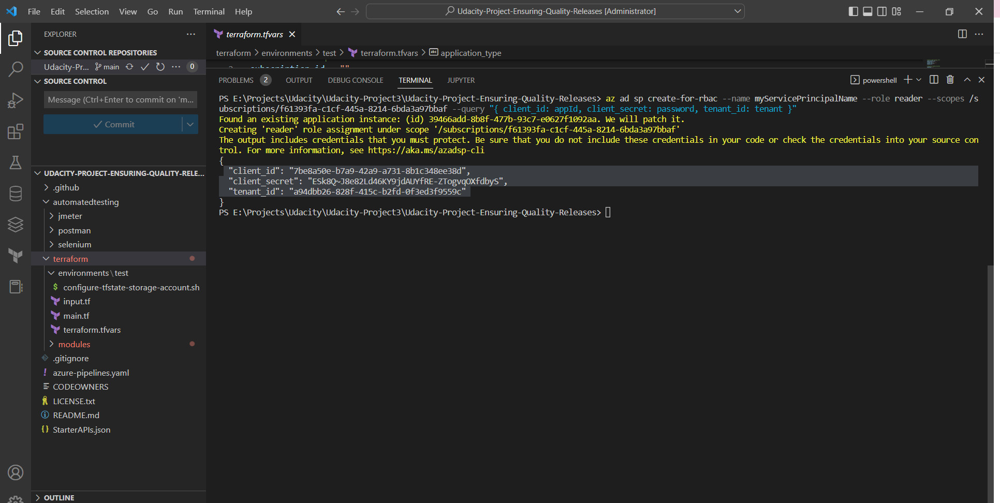

# Overview
In this project, we will develop and demonstrate for using a variety of industry leading tools, especially Microsoft Azure, to create disposable test environments and run a variety of automated tests. Additionally, we'll monitor and provide insight into your application's behavior, and determine root causes by querying the application’s custom log files.

# Prequisite
* This tutorial is performed on Linux Ubuntu 20.04 LTS
* You have to install:
    * Azure CLI
    * Visual studio code (VS code)
    * Terraform (If you want to test terraform step on local)
    * Postman
    * Jmeter
    * Selenium


# Instructions
## I. Setup azure devops
### 1. Clone the project
* Open bash and clone project using this command:

``` bash
$ git clone https://github.com/hinhnh/Udacity-Project-Ensuring-Quality-Releases.git
```

* Go to project folder and open it with VS code:
``` bash
$ cd Udacity-Project-Ensuring-Quality-Releases.git
$ code .
```   
### 2. Login to azure devops
Go to https://dev.azure.com and login using your azure account.

### 3. Create a project
* Allow create public projects


* Create a public project


### 4. Create a service connection to Azure
Create a service connection that enable terraform to access to Azure resource for creating resources:


### 5. Create a service principal
Create a service principal for terraform uses later.
```
$az ad sp create-for-rbac --role="Contributor" --scopes="/subscriptions/_subscription_id"
```
### 6. Create storage account for store terraform state
* Open bash in the project and login:
```
$ az login
```
* Run bellow commands and copy the storage account info for later use in terraform:
```
$ cd cd terraform/environments/test/
$ ./configure-tfstate-storage-account.sh
```

## II. Update configuration in the project configuration
### 1. Configure the storage for store terraform storage using output of [this](#7-create-storage-account-for-store-terraform-state) step
* Update the storage in main.tf


* Update the storage in terraform.varstf


### 2. Configure the service principal
* Update the terraform.tfvars using ouput in [this](#6-create-a-service-principal) step



**Note:** you might want to update username and password of virtual machine used for agent pool as well in line 20,21
## 3. Test terraform in local
You can test terraform in local by using these commands:
```
# Init
$ terraform init

# Output a plan
$ terraform plan -out Solution.plan

# Apply the plan
$ terraform apply Solution.plan
```
### 4. Commit and Push codes to your git hub repository.
After finish all of above steps. You need to create a repository in Gihub and push code into it for later use in create pipeline.

## III. Create a pipeline
### 1. Create a pipeline with an existing yaml file


### 2. Install the terraform extension
Go to this [page]( https://marketplace.visualstudio.com/acquisition?itemName=ms-devlabs.custom-terraform-tasks) and install extension.


### 3. Execute the pipeline and see result:
After create the pipeline you can go to the pipeline and run it:


## IV. Result

### 1. Execution terraform successfully
* Output from pipeline: 

* Output from portal:

### 2. Execution of the whole pipeline successfully

### 3. Execution result of postman.

##3 4. Execution result of Selenium and logging.

### 5. Execution result of Jmeter.
* an HTML resport

* log output of Jmeter in CI/CD

### 6. Alerts were triggered by AppService for NotFound requests
* Email sent by azure

* The resource triggers alerts

* The alert rule

* Resources' metric

### 7. Log analytic query of AppService
