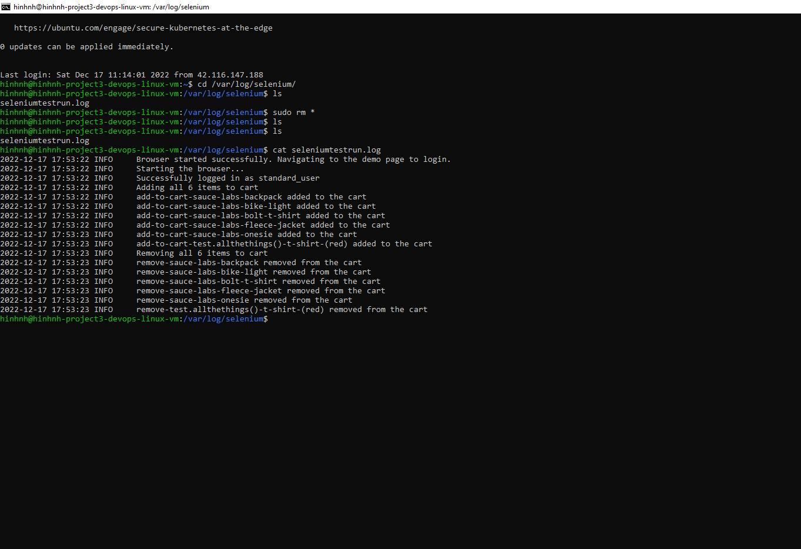
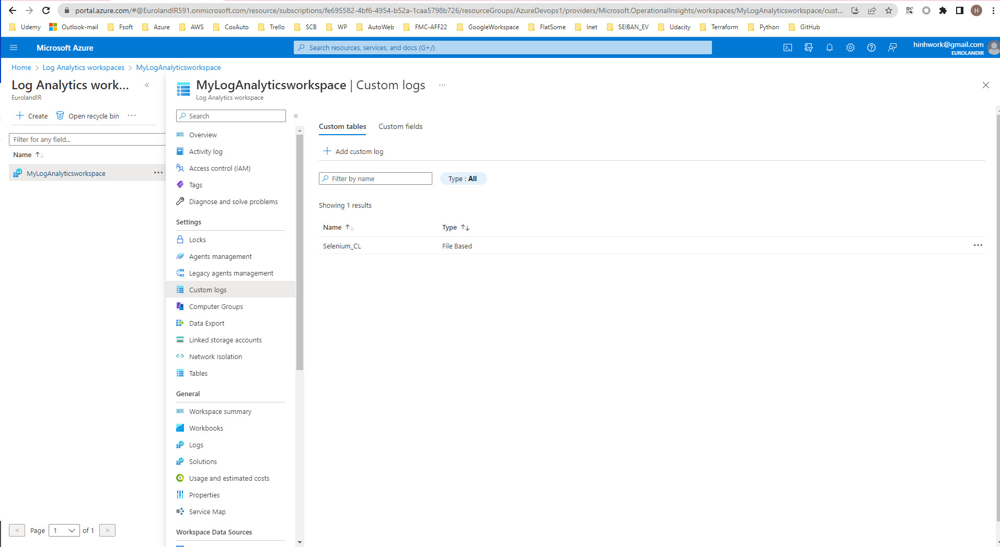
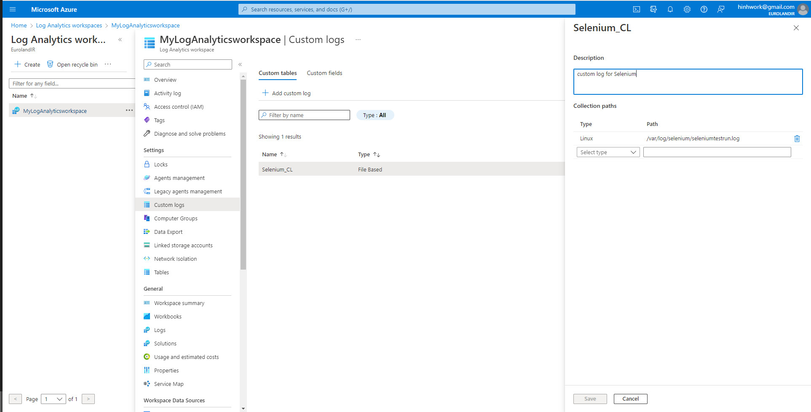

Dear Reviewer,
I have configured my custom log for selenium as follow:
# public logs to */var/logs/selenium* folder in virtual machine of environment

# connect vm to *log analytic workspace*

# create custom log

# run the query

However after many hours I can't see the logs when I query. I asked my some coworkers who learned this course before and they said it sometime appear sometimes not and have to wait 1h to several days. 
Currently I have a lot of other pending work to do because I have to finish this course by end of today occording to my organization policy then I spent most of last week for it. 

So, I'm very thankful if you can consider checking my work steps above instead of the result of log query.

Thank you in advance!
Student: Hinh Nguyen